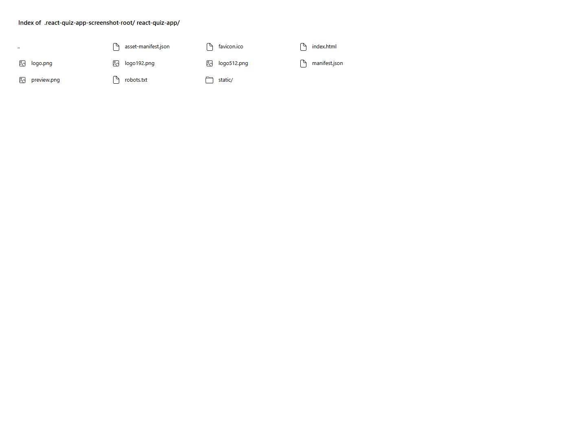

# Capital Quiz

A responsive React quiz that tests knowledge of Indian capitals with clear answer choices, progress feedback, score tracking and restart support.

## Features

- Five focused general knowledge questions
- Accessible radio options and disabled submit state until an answer is selected
- Progress indicator, final score and restart action
- Responsive fixed header and icon-only footer links
- Floating go-to-top control with smooth scrolling

## Tech Stack

React, JavaScript, Create React App and CSS.

## Run locally

```bash
npm install
npm start
```

## Build and deploy

```bash
npm run build
npm run deploy
```

Live URL: [https://a2rp.github.io/react-quiz-app/](https://a2rp.github.io/react-quiz-app/)

## Preview



## Links

- [Portfolio](https://www.ashishranjan.net/)
- [GitHub](https://github.com/a2rp)
- [CodePen](https://codepen.io/ash1198)
- [LinkedIn](https://www.linkedin.com/in/aashishranjan)
- [Facebook](https://www.facebook.com/theash.ashish/)
- [YouTube](https://www.youtube.com/@ashishranjan-ashz?sub_confirmation=1)
- [Email](mailto:ash.ranjan09@gmail.com)

## Support

- [Support](https://a2rp-donation-page.netlify.app/)
- [Buy Me a Coffee](https://buymeacoffee.com/a2rp)
- [Patreon](https://patreon.com/a2rp)